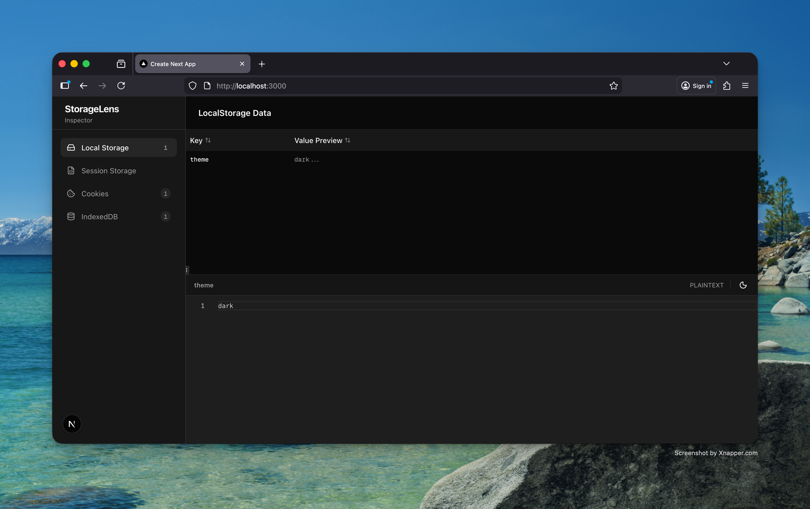

# StorageLens



An open-source browser storage inspector/explorer built with Next.js. Inspect and manage Cookies, LocalStorage, SessionStorage, and IndexedDB with a clean, developer-friendly interface.

## Getting Started

Run the development server:

```bash
npm install && npm run dev
```

Open [http://localhost:3000](http://localhost:3000) to view the dashboard.
